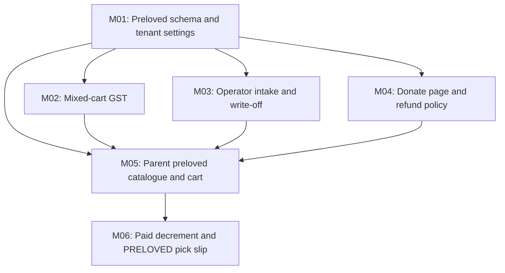

# Project Roadmap: Preloved donation rack (Phase 1)

<!-- gq-spec roadmap — the durable source of truth and global to-do list.
     Edited by gq-spec-plan-grok (structure) and gq-spec-build-grok (status checkboxes).
     Source design owns WHAT/WHY; this roadmap owns milestone sequencing only. -->

build_mode: auto            <!-- auto | spec-then-build  (sticky default for /gq-spec-build-grok) -->
source_docs:
  - specs/context/plan-preloved-shop.md
  - specs/context/research-australian-second-hand-uniform-trading.md
ownership:
  what_why: source design (docs/second-hand/plan-preloved-shop.md, approved 2026-09-06)
  sequencing: this roadmap + milestone briefs
generated: 2026-09-06

## Overview

UniformOrder already sells **new** uniforms for a school / P&C (seller of record, Stripe Connect, pickup Kanban). Phase 1 adds the common Australian **donation-only preloved rack** in that same shop: parents drop washed current-uniform items; operators inspect, price, and list; other parents buy preloved next to new in the same cart and collect at pickup. Consignment and parent-to-parent marketplaces are out of this roadmap.

## Tech stack & verification

- **Stack:** pnpm workspace, Next.js 16 App Router (`apps/web`), TypeScript, Tailwind v4, HeroUI OSS (`@heroui/react` only — no `@heroui-pro/*`), Neon Postgres + Drizzle (`db.batch`, not `db.transaction`), Stripe Connect Standard, Hostinger standalone (not Vercel)
- **Lint:** not configured  ·  **Typecheck:** `pnpm check-types:web`  ·  **Test:** no suite configured
- **UI proof (parent/admin slices):** `playwright-cli` against `pnpm dev:web` (process `0200` Step 3b)

## Dependency chart (ASCII)

```text
  ┌─────────────────────────────────────────────────────────────┐
  │                       START (no dependencies)                 │
  └─────────────────────────────────────────────────────────────┘
                                   │
                                   ▼
   ┌─────────────────────────────────────────────────────────────┐
   │  Wave 1                                                      │
   │  M01: Preloved schema and tenant settings                    │
   └─────────────────────────────────────────────────────────────┘
                  │                    │                    │
                  ▼                    ▼                    ▼
   ┌──────────────────────┐ ┌──────────────────────┐ ┌──────────────────────┐
   │  Wave 2              │ │  Wave 2              │ │  Wave 2              │
   │  M02: Mixed-cart GST │ │  M03: Operator intake│ │  M04: Donate page    │
   └──────────────────────┘ └──────────────────────┘ └──────────────────────┘
                  │                    │                    │
                  └────────────────────┼────────────────────┘
                                       ▼
   ┌─────────────────────────────────────────────────────────────┐
   │  Wave 3 (depends on M01, M02, M03, M04)                      │
   │  M05: Parent preloved catalogue and cart                     │
   └─────────────────────────────────────────────────────────────┘
                                       │
                                       ▼
   ┌─────────────────────────────────────────────────────────────┐
   │  Wave 4 (depends on M05)                                     │
   │  M06: Paid decrement and PRELOVED pick slip                  │
   └─────────────────────────────────────────────────────────────┘
```

## Dependency graph (Mermaid)



## Waves

| Wave | Milestones | Delivers |
|------|------------|----------|
| 1 | M01 | Tenant opt-in, pooled preloved SKU schema, settings UI. No parent buy yet. |
| 2 | M02, M03, M04 | GST on mixed carts; operator can intake/write off; parents can read donate + refund rules. Parallel-safe if M03 keeps preloved queries out of the reports/totals files M02 owns. |
| 3 | M05 | Parents browse/buy preloved next to new, stock-capped. |
| 4 | M06 | Paid orders decrement qty; pick slip marks PRELOVED. End-to-end donation rack. |

## Milestones (to-do)

### Wave 1
- [x] [M01 — Preloved schema and tenant settings](./milestones/M01-preloved-foundation.md) — deps: none

### Wave 2
- [x] [M02 — Mixed-cart GST](./milestones/M02-mixed-cart-gst.md) — deps: M01
- [x] [M03 — Operator intake and write-off](./milestones/M03-operator-intake.md) — deps: M01
- [x] [M04 — Donate page and refund policy](./milestones/M04-donate-and-refund-policy.md) — deps: M01

### Wave 3
- [x] [M05 — Parent preloved catalogue and cart](./milestones/M05-parent-preloved-shop.md) — deps: M01, M02, M03, M04

### Wave 4
- [ ] [M06 — Paid decrement and PRELOVED pick slip](./milestones/M06-preloved-fulfilment.md) — deps: M05

## Project Definition of Done

- [x] A tenant can opt in to a donation-only preloved rack and configure price fraction, hold days, refuse list, and GST-free declaration (default off).
- [x] Operators accept/reject donated garments, pool qty by source item + size + condition, price from the new variant (default 50%, warn above cap), and write off expired stock to charity.
- [x] Parents see donate instructions (drop-off, not self-listing), browse preloved next to new, add mixed carts with stock caps, and pay the school’s Stripe Connect account.
- [x] Donated preloved lines are GST-free only when the tenant declared `donatedGstFree`; reports CSV splits GST-free preloved vs taxable sales.
- [ ] Paid preloved qty decrements; pick slips mark PRELOVED; oversell fails PaymentIntent creation.
- [ ] Refund policy states sold-as-worn / no change-of-mind / ACL still applies. No C2C listings, consignment, escrow, or inventory on new catalogue.
- [ ] `pnpm check-types:web` passes. Parent/admin UI slices proven with playwright-cli on `pnpm dev:web`.
